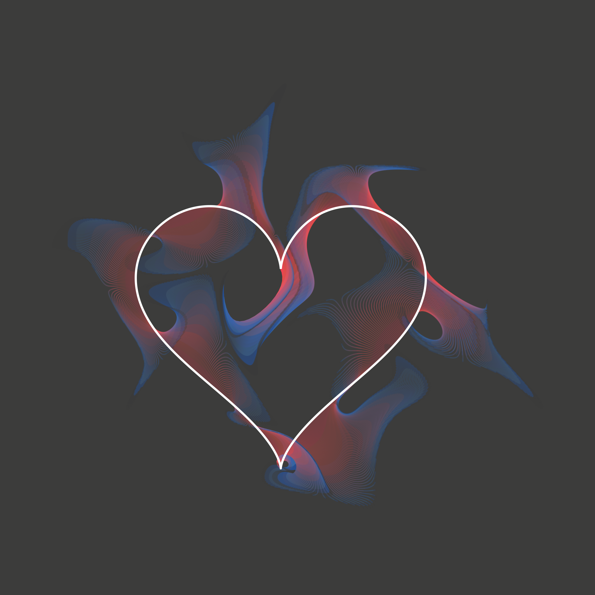
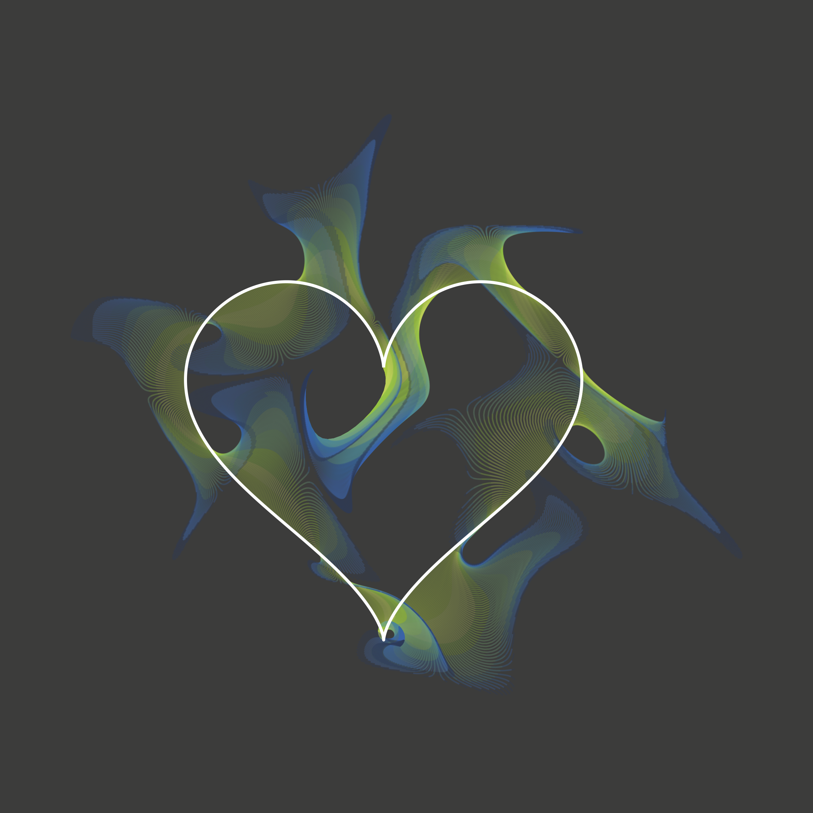

# correlart

Collection of scripts to generate generative art.

## correlhearts
Hearts with CorrelAid and CorrelAidX color palettes using `jasmines::unity_heart` from the [`{jasmines}`](https://github.com/djnavarro/jasmines) :package: package. 

